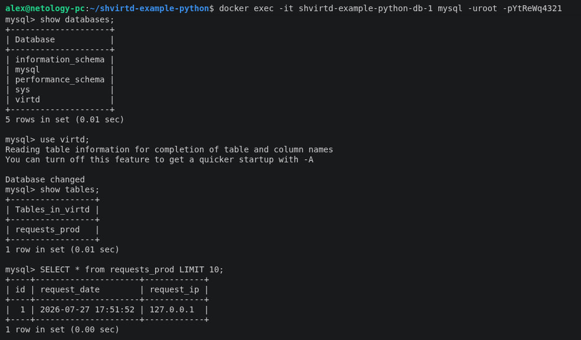
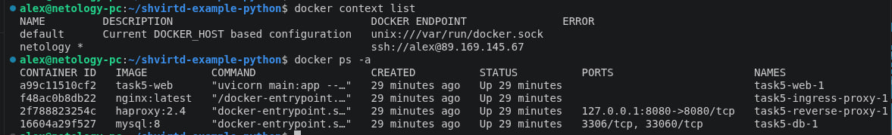
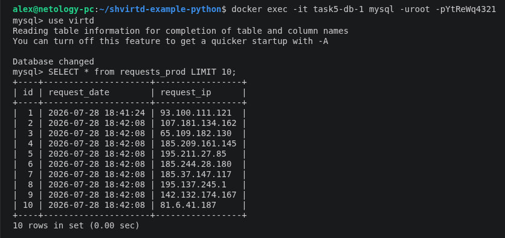
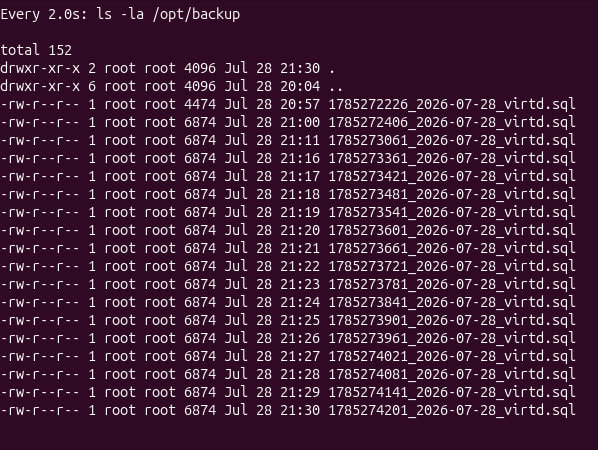
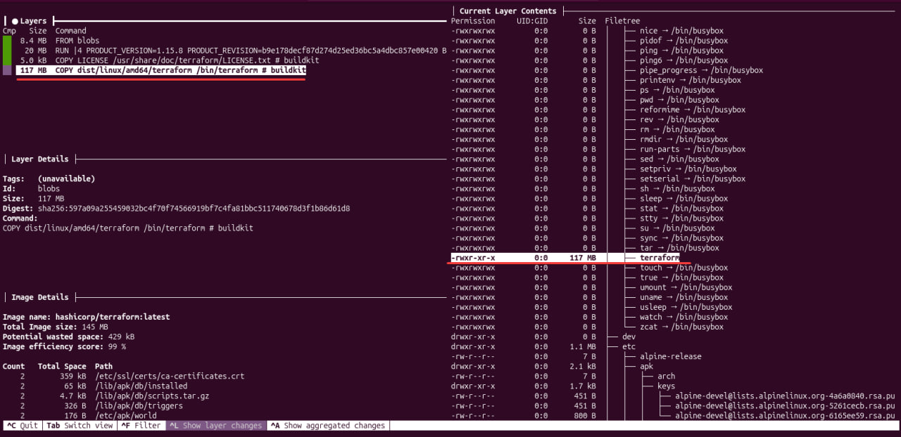
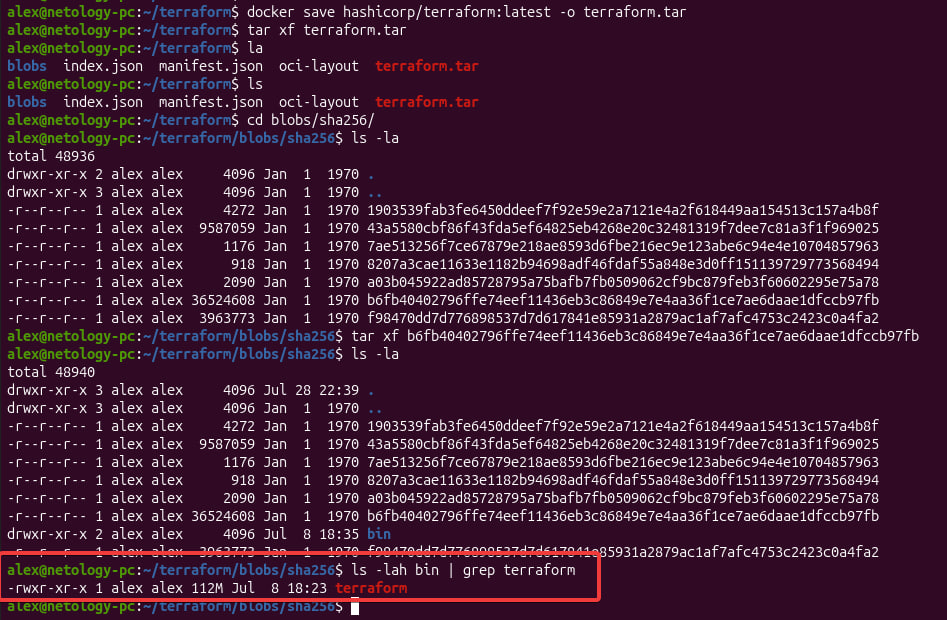

## Задача 2 (*)
[Отчет сканирования](answers/vulnerabilities.csv)

## Задача 3


## Задача 4
Настроен remote ssh context для Docker:


Выполнение SQL-запроса:


## Задача 5 (*)
[Backup скрипт](backup.sh)

Для работы скрипта пришлось заменить образ с ```schnitzler/mysqldum``` на ```mysql:8.0```, иначе возникала ошибка, связанная с устаревшей версией клиента:
```
mysqldump: Got error: 1045: "Plugin caching_sha2_password could not be loaded: Error loading shared library /usr/lib/mariadb/plugin/caching_sha2_password.so: No such file or directory" when trying to connect
```

Подразумевается, что пароль и логин не будет светиться в git, если организовать хранение .env файла в хранилище секретов.

Cron-task (sudo):
```
* * * * * cd /opt/task5 && /usr/bin/bash backup.sh
```




## Задача 6
ID слоя в dive больше не указывается, поэтому пришлось делать перебором.




